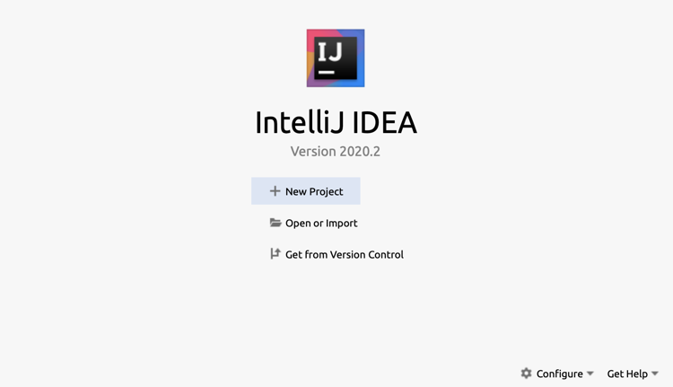
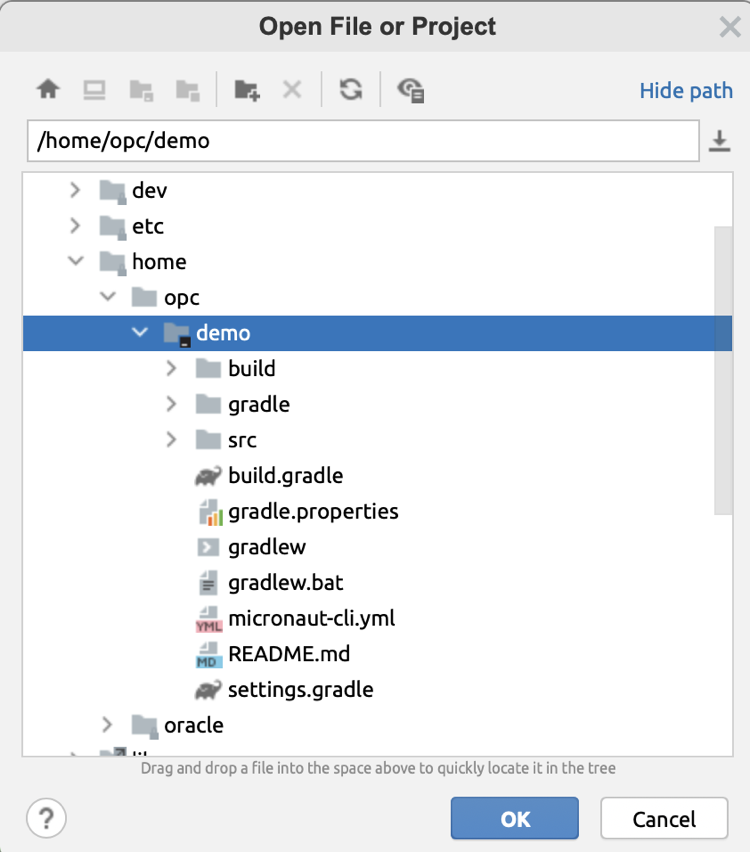

# Prerequisites

## Before We Begin

This workshop is designed to be delivered virtually and entirely through your web browser hence the only prerequisite is a modern browser such as Chrome, Edge or Firefox.

This avoids the need for attendees to get setup locally with the necessary tooling and development environment. The virtual environment provided is pre-configured with:

* Micronaut 2.3.0
* GraalVM 21.0.0 for JDK 11
* The Oracle Cloud CLI
* Docker
* JetBrains Projector IDE 

## Setup Virtual Environment

Prior to beginning, the lab you need to create the virtual environment to run the lab. To do this you are going to use a Terraform stack with Oracle Cloud Resource Manager. Click the following button to create the stack:

[![Deploy to Oracle Cloud][magic_button]][magic_jidea_terraform_stack]

[magic_button]: https://oci-resourcemanager-plugin.plugins.oci.oraclecloud.com/latest/deploy-to-oracle-cloud.svg
[magic_jidea_terraform_stack]: https://cloud.oracle.com/resourcemanager/stacks/create?zipUrl=https://objectstorage.us-ashburn-1.oraclecloud.com/n/cloudnative-devrel/b/micronaut-hol/o/terraform%2Fjidea-image.zip

## Launch IDE in Web Browser

The IDE is based on JetBrains Projector with IntelliJ Community Edition and you should perform the following steps before you begin:

1. Navigate to the URL provided by your instructor
2. You will likely receive an HTTPS warning about the certificate. In Chrome you should click "Advanced" and then the "Proceed" link to continue.
3. If for any reason the page doesn't load try hit the refresh button.
4. From the "Project Dialog" select "Open or Import"

    

5. Navigate to `/home/opc/demo` and open the directory

    
