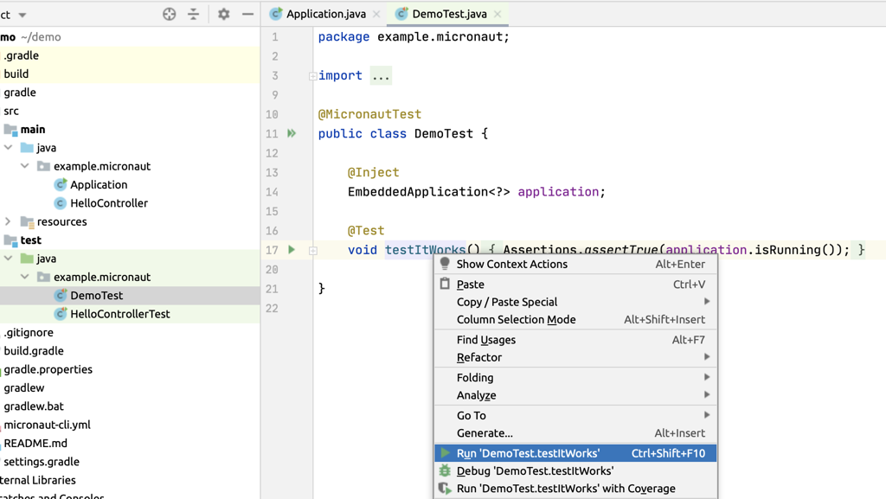

# Getting to Know Micronaut

## Introduction
In this lab you are going to learn how to navigate around a Micronaut project structure.

Estimated Lab Time: 10 minutes

### Objectives

In this lab you will:
* Learn the layout of a Micronaut project
* Run your first Micronaut application
* Run the tests for your first Micronaut Application

### Prerequisites
- Access to your project instance


## Project Structure
Micronaut projects are structured as per standard Maven-based project conventions.

The following logical structure exists for the application:

* `src/main/java` - This directory contains your Java source code
* `src/main/resources` - The resources directory contains application configuration 
* `src/main/resources/application.yml` - A Micronaut application can be configured using YAML, properties files, JSON and many other means. The default is `application.yml` where you can find your application configuration.
* `src/main/resources/logback.xml` - By default Micronaut using [logback](http://logback.qos.ch) for logging configuration. The `logback.xml` file defines your logging configuration.
* `build.gradle` or `pom.xml` - Depending which build tool you chose you will either have a `build.gradle` for the [Gradle build tool](https://gradle.org) or `pom.xml` for the [Maven build tool](https://maven.apache.org) which defines your application build file.

## Running the Application
A Micronaut application can be run using the `Application` class that features a `main` method that can be executed. A simple `Application` class looks like the following:

```java
package example.micronaut;

import io.micronaut.runtime.Micronaut;

public class Application {

    public static void main(String[] args) {
        Micronaut.run(Application.class, args);
    }
}
```

The `io.micronaut.runtime.Micronaut` class is used to bootstrap Micronaut and start the application on port 8080 by default using the embedded Netty-based server.

You can run the application by right clicking in the cloud IDE and running the main method and then accessing the application via `http://[YOUR IP]:8080`. 

Try this now:


## Automatic Restarts
It is often convenient to have changes you make to your application reflected automatically via a restart of the server.

To do this open Terminal (by clicking ALT+F12 or the Terminal button at the bottom of the window) and type `./gradlew run -t` for Gradle or `./mvnw mn:run` for Maven.

Now every time you make a change to one of the sources the server will automatically restart and reflect the change.


## Running Tests 
You can run tests in the project simply by right-clicking on the test you wish to run and running the test.

Try this now:



You may now *proceed to the next lab*.

### Acknowledgements
- **Owners** - Graeme Rocher, Architect, Oracle Labs - Databases and Optimization
- **Contributors** - Palo Gressa, Todd Sharp, Eric Sedlar

